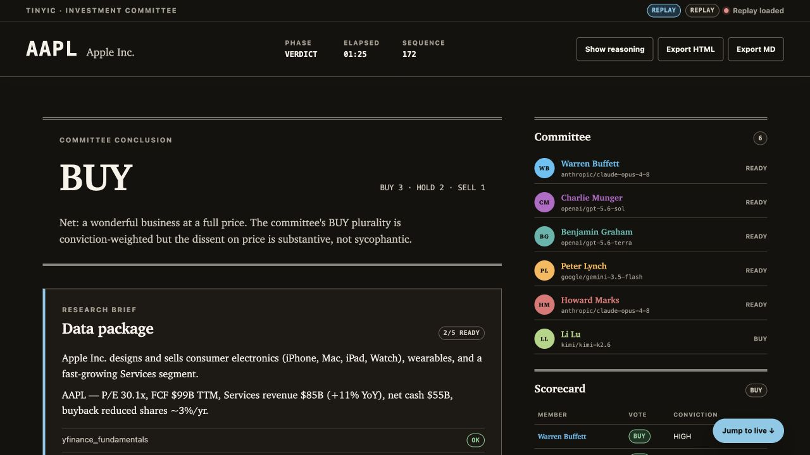
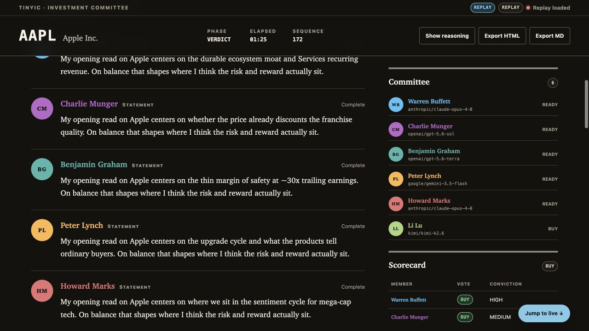

# TinyIC

**An AI investment committee you can watch deliberate.** TinyIC convenes
Buffett, Munger, Graham, Lynch, Marks, and Li Lu—or a committee you
configure—to debate a public company in a secured local Town Hall.

[](https://www.python.org/downloads/)
[](src/tinyic/pyproject.toml)
[](LICENSE)
[](AGENTS.md)

Enter a ticker or company name. The committee works through opening theses,
cross-examination, rebuttals, and final votes while you watch, steer, pause, or
interrupt. Each run becomes a replayable JSONL record plus a scorecard,
investment memo, disagreement analysis, and measured usage.

> [!WARNING]
> **TinyIC is an educational research tool, not investment advice.** Its output
> is AI-generated and may be incomplete or wrong. Do your own diligence and
> consult a licensed professional before making investment decisions. The
> investor personas are simulations based on public records; they are not
> affiliated with, endorsed by, or representative of the named investors.

## Quick start

TinyIC is distributed from Git source, not PyPI. You need Python 3.12+,
[uv](https://docs.astral.sh/uv/), and one usable model lane: an API key, a
supported subscription runtime, or local Ollama.

Node.js and npm are not part of the current installation path. The Town Hall is
a zero-build web interface whose assets ship with the Python package.

```bash
git clone https://github.com/Lego1997/TineyIC.git
cd TineyIC

uv sync
uv run tinyic onboard
uv run tinyic debate AAPL
```

`onboard` detects available providers, verifies the lane you choose, and stores
verified credentials in a keyring-first profile store (with a mode-`0600` file
fallback). `debate` opens the live Town Hall in your browser. Recorded runs
live under `~/.tinyic/runs/`.

Check setup without starting a debate:

```bash
uv run tinyic doctor --json
uv run tinyic models --json
```

`doctor --live` performs an explicit remote model probe; `models --refresh`
queries provider catalogs. The commands above use only local configuration and
the shipped static catalog.

For a one-shot command from a clone:

```bash
uvx --from ./src/tinyic tinyic --help
```

Or run directly from the Git repository:

```bash
uvx --from 'git+https://github.com/Lego1997/TineyIC.git#subdirectory=src/tinyic' tinyic --help
```

## Interface preview



*A completed AAPL debate in the local Town Hall, showing the committee verdict,
dissent, and scorecard.*



*The same run's recorded proceedings: phase-by-phase transcript on the left;
committee votes and the scorecard on the right.*

## Why TinyIC

- **Deliberation, not parallel role-play.** Personas challenge one another under
  a structured moderator, anti-convergence prompts, and a rotating devil's
  advocate.
- **Live control.** Steer the next turn, queue an instruction for the next
  phase, target a persona, pause, advance, interrupt, or stop.
- **Inspectable reasoning.** Simulated agent THINK actions, provider-returned
  reasoning, and cognitive-state updates are first-class parts of the live and
  replay views.
- **Durable record.** The append-only event log can be replayed, exported,
  audited, or assembled into a result document without another model call.
- **Agent-native operation.** JSONL stays clean on STDOUT, diagnostics stay on
  STDERR, and steering commands have a documented acknowledgement lifecycle.
- **Flexible committees.** Mix two to six built-in or researched personas and
  bind roles to OpenAI, Anthropic, Grok, Google, Kimi, or Ollama models.

## The committee and protocol

| Persona | Registry slug | Investment lens |
|---|---|---|
| Warren Buffett | `warren_buffett` | Durable moats, quality, long-term compounding |
| Charlie Munger | `charlie_munger` | Mental models, inversion, quality over cheapness |
| Benjamin Graham | `benjamin_graham` | Margin of safety, quantitative discipline |
| Peter Lynch | `peter_lynch` | Scuttlebutt, understandable growth, valuation |
| Howard Marks | `howard_marks` | Cycles, second-level thinking, downside risk |
| Li Lu | `li_lu` | Circle of competence, durable value, long horizons |

Every debate follows four phases:

1. **Opening** — each persona states a thesis, stance, and supporting claims.
2. **Cross-examination** — members challenge assumptions while a devil's
   advocate presses the emerging consensus.
3. **Rebuttal** — each member answers criticism and updates or defends its view.
4. **Verdict** — each member records Buy, Hold, or Sell with confidence and
   reasoning.

TinyIC assembles the scorecard and deterministic collapse metrics. The
aggregator writes a five-section investment memo and disagreement analysis
grounded in the committed debate transcript.

## Run and steer a debate

The default command launches the six-member committee in a browser:

```bash
uv run tinyic debate AAPL
uv run tinyic debate NVDA --personas warren_buffett,howard_marks,li_lu
uv run tinyic debate Costco --thinking high
uv run tinyic debate AAPL --no-open
uv run tinyic debate AAPL --port 8765 --no-wait
```

Prefer an exact ticker when you know it. Company-name input uses best-effort
symbol resolution and surfaces an unverified-resolution warning when it cannot
confirm the match.

The Town Hall streams speech and reasoning over SSE and shows the phase
timeline, model bindings, steering history, votes, scorecard, memo,
disagreements, and usage. Controls let you:

- steer the next speaker turn, optionally targeting one persona;
- queue an instruction for the next phase;
- pause or resume and manually advance a paused phase;
- interrupt the active turn and let that speaker retake once;
- toggle displayed reasoning, stop gracefully, or export the result.

The viewer is a **local capability**, not a hosted service. It binds only to
`127.0.0.1`, uses a fresh capability URL and protected cookie, validates Host
and Origin, accepts authenticated JSON-only writes, denies framing, and escapes
model output before rendering it. Replay uses the same interface with every
write action disabled.

## Drive TinyIC headlessly

```bash
uv run tinyic debate AAPL --headless --json > aapl.events.jsonl
```

In `--json` mode, STDOUT contains only one event object per line. Progress and
diagnostics go to STDERR. Parse STDOUT line-by-line and ignore unknown additive
event types and fields.

Steer a live headless run through STDIN:

```bash
printf '%s\n' \
  '{"type":"steer","target":"Warren Buffett","text":"Press the China supply-chain risk."}' \
  '{"type":"queue","text":"Tie every verdict to a valuation multiple."}' \
  | uv run tinyic debate AAPL --headless --json --steer-stdin > aapl.events.jsonl
```

`steer` and `queue` emit `steering_submitted` followed by exactly one
`steering_delivered` or `steering_dropped`. An `interrupt` is acknowledged
by `turn_interrupted` only when it affects a turn.

See [AGENTS.md](AGENTS.md) for the complete headless contract and
[docs/event-schema.md](docs/event-schema.md) for schema v1.

## Replay, inspect, and export

Every recorded log can be consumed with zero additional LLM calls:

```bash
uv run tinyic runs list --json
uv run tinyic replay <debate_id>
uv run tinyic result <debate_id> --json
uv run tinyic export <debate_id> --html -o debate.html
uv run tinyic export <debate_id> --md -o debate.md
```

`replay` accepts a debate ID or JSONL path and supports `--port`, `--no-open`,
and `--no-wait`. HTML export is one self-contained file with no external
assets; Markdown export includes the scorecard, memo, transcript, and
disagreements. Truncated logs remain inspectable and report an incomplete,
partial, or error status instead of being presented as complete.

## Build a cited investor persona

Persona research creates an educational, public-record simulation as two
artifacts: an agent configuration and a cited Markdown dossier.

```bash
uv run tinyic persona research "Howard Marks" \
  --slug howard_marks_researched --max-searches 4

uv run tinyic persona list --json
uv run tinyic persona show howard_marks_researched --json
```

Research requires a search-capable **API-key lane**. TinyIC shows a cost
estimate before provider calls, caps billable search units, deduplicates the
evidence ledger, verifies claims and quotations, and refuses to install an
artifact backed by fewer than three independent source domains. Built-in slugs
cannot be overwritten. Existing user artifacts require `--force` and are
replaced as a guarded pair with rollback on failure.

The research and verification passes are provider-side; TinyIC does not
independently fetch every cited page. Review the dossier and verify important
claims and quotations against their original sources before relying on them.
Automation must add `--yes` only after it has reviewed the estimate written to
STDERR.

Artifacts are installed under:

```text
~/.tinyic/personas/<slug>.agent.json
~/.tinyic/personas/<slug>.dossier.md
```

Choose two to six personas for one debate with `--personas`, or set a default
committee at the top level of `~/.tinyic/tinyic.toml`:

```toml
committee = ["warren_buffett", "howard_marks_researched", "li_lu"]
```

Resolution order is `--personas` → user-overlay `committee` → the built-in
six. Unknown, duplicate, or out-of-range committees fail validation.

## Models and credentials

| Provider | API-key environment variable | Supported non-key lane |
|---|---|---|
| OpenAI | `OPENAI_API_KEY` | Existing Codex/ChatGPT runtime |
| Anthropic | `ANTHROPIC_API_KEY` | Existing Claude Code runtime |
| Grok | `XAI_API_KEY` | Grok CLI read-through or TinyIC device code |
| Google | `GEMINI_API_KEY` | — |
| Kimi | `MOONSHOT_API_KEY` or `KIMI_API_KEY` | — |
| Ollama | — | Local runtime |

Environment variables are honored, while `onboard` is the recommended
verify-and-persist flow. Anthropic and Grok subscription routes have explicit
policy guards in `tinyic.toml`; API-key profiles can remain configured as
overflow.

Use a named preset or override every role for one run:

```bash
uv run tinyic debate AAPL --preset heterogeneous
uv run tinyic debate AAPL --model anthropic/claude-opus-4-8 --thinking high
uv run tinyic models anthropic --json
```

The shipped `heterogeneous` preset is an advanced example that needs usable
OpenAI, Anthropic, and Kimi routes. Start with the default preset when you have
one lane.

The shipped `models` catalog is static and offline. Add `--refresh` only when
you want live provider listings.

## Persistence, cost, and scope

- A full six-member debate typically makes about **30–45 model calls** and
  takes minutes, not seconds. Cost depends on the selected models and reasoning
  levels.
- API-key debate and research calls record provider-reported token usage where
  available. Their `cost_usd` values are estimates from TinyIC's frozen
  list-price table, not provider invoices. Subscription lanes emit a local
  message-window estimate instead.
- Provider-side tool/search fees and some external data-source charges may not
  appear in TinyIC's model-usage estimate.
- Fewer personas, `--no-research`, a cheaper model, or a lower
  `--thinking` level reduce time and spend.
- Secrets and OAuth material are excluded from events, logs, exports, and
  generated persona artifacts.
- Logs and HTML/Markdown exports intentionally include model reasoning and user
  steering. Review them before sharing, and never place credentials or other
  secrets in prompts or steering messages.
- Debate inputs and gathered market data are sent to the model and data
  providers you configure. `--no-research` skips the web-research source only;
  it does not disable financials, filings, news, or other enabled data sources.
- TinyIC is local and single-user. It has no brokerage, trading, portfolio, or
  hosted multi-user integration.

## Architecture

```text
              personas · moderator · data · models
                              │
                              ▼
                    ┌───────────────────┐
                    │   TinyIC engine   │
                    └─────────┬─────────┘
                              │ typed schema-v1 events
                              ▼
                    ┌───────────────────┐
                    │ append-only JSONL │
                    └───┬────────┬──────┘
                        │        │
                 ┌──────▼─┐  ┌───▼──────────────┐
                 │ Town   │  │ headless, replay │
                 │ Hall   │  │ result, exports  │
                 └────────┘  └──────────────────┘
```

The event stream is the only engine-to-renderer channel. Live viewing, replay,
headless automation, result assembly, and export all consume the same durable
log.

The repository is a two-package uv workspace:

- `src/tinyic/` — application, debate engine, data pipeline, model/auth layer,
  persona factory, web viewer, event log, and renderers.
- `src/tinytroupe/` — pinned Microsoft TinyTroupe 0.7.0 fork. Changes require
  the vendored divergence and manifest ceremony documented in
  [CLAUDE.md](CLAUDE.md).

## Development

```bash
uv sync
uv run pytest tests/
uv lock --check --offline
```

The default test suite is offline: LLM and network surfaces use fixtures or
mock transports. Live provider checks are opt-in:

```bash
uv run pytest tests/ -m live_api
```

Before changing the code, read [CLAUDE.md](CLAUDE.md). Useful references:

| Document | Purpose |
|---|---|
| [AGENTS.md](AGENTS.md) | Headless installation, steering, events, costs, and exit codes |
| [docs/event-schema.md](docs/event-schema.md) | Frozen JSONL schema-v1 contract |
| [docs/PRD.md](docs/PRD.md) | Product requirements and amendments |
| [src/tinytroupe/FORK.md](src/tinytroupe/FORK.md) | Vendored fork history and allowed divergences |

For bugs or documentation gaps, [open a GitHub issue](https://github.com/Lego1997/TineyIC/issues).

## License and acknowledgements

TinyIC is available under the [MIT License](LICENSE). It vendors a documented
fork of [Microsoft TinyTroupe](https://github.com/microsoft/TinyTroupe) for
multi-agent persona simulation and draws on the public investment writings of
the six built-in investors.
